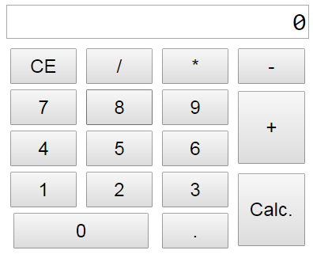

# Calculator_JS
Simple calculator made using HTML, CSS and JS



## Developement
+ Developed using **HTML5**, **CSS3** and **JavaScript**
+ Used **VSCode** *version 1.29.1* as editor
+ Tested on **Google Chrome** *version 71.0.3578.80 (Official Build) (64-bit)* on **Windows 7**

## Cloning
To clone this repository to your local machine.
```cmd
git clone https://github.com/OjeshManandhar/Calculator_JS.git
```

## Issues
If you're interested, feel free to fork and submit PR.
- Result of decimal operator is not rounded properly like sometimes **"15.5"** is displayed as **"15.5000000000000001"**

## License
This project is licensed under the MIT License - see the [LICENSE](LICENSE) file for details.
